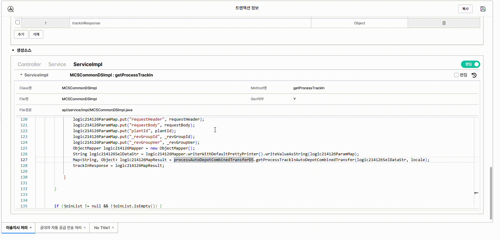
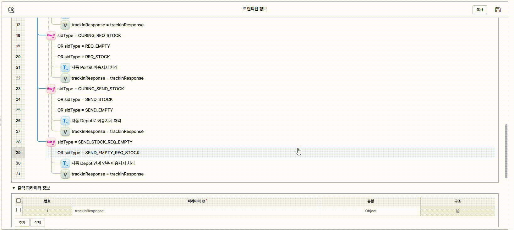

# LAMP7 Genie

LAMP7 `이벤트/트랜잭션 설정` 화면에서 로직 검색과 간단한 편집 작업을 돕는 Chrome Extension입니다.

## 목차

- [설치 가이드](#설치-가이드)
- [주의사항](#주의사항)
- [기능](#기능)
- [단축키](#단축키)

## 설치 가이드

압축 파일을 제공받은 경우 먼저 압축을 해제하세요. 압축을 풀면 안에 `dist` 폴더가 있으며, 아래 2번부터 따라 하면 됩니다.

1. 직접 빌드해서 설치하는 경우 프로젝트를 빌드합니다.
  ```bash
   npm run build
  ```
2. Chrome에서 확장 프로그램 관리 화면을 엽니다.
  ```text
   chrome://extensions
  ```
3. 오른쪽 상단의 **개발자 모드**를 켭니다.
4. **압축해제된 확장 프로그램을 로드합니다**를 클릭합니다.
5. 프로젝트의 `dist` 폴더를 선택합니다.
6. LAMP7 `이벤트/트랜잭션 설정` 화면에서 확장 프로그램 아이콘을 클릭해 패널을 엽니다.


## 주의사항

이 확장 프로그램은 LAMP7 공식 기능이 아니라 개인이 편의를 위해 만든 보조 도구입니다. 사용 환경이나 LAMP7 화면 구조 변경에 따라 일부 기능이 정상적으로 동작하지 않을 수 있습니다.

특히 로직 복사/붙여넣기 과정에서 내부 데이터가 완전히 동일하게 복사되지 않을 수 있으며, 이 경우 소스 생성 중 오류가 발생할 수 있습니다. 복사/붙여넣기 후에는 항상 생성된 소스를 확인하고, 오류가 발생하면 사용자가 직접 수정해야 합니다.

## 기능


### 검색

생성된 코드에서 본 변수명, Transaction 호출 메소드명, Event/Variable ID 등을 검색하면 해당 로직 위치를 찾아줍니다.

- 로직 Prefix ex) `logic18038`
- Event / Transaction / Variable ID
- Transaction 호출 메소드명
- Condition / Parameter 값



### 편집

필요한 로직을 삭제하거나, 로직을 복사해서 다른 위치에 붙여넣을 수 있습니다.

- 로직 삭제
- 로직 복사/붙여넣기



## 단축키

- 확장 프로그램 아이콘 클릭: 패널 열기/닫기
- `Alt + Shift + F`: 패널을 열고 검색창에 포커스
- 검색창에서 `Enter`: 검색 실행 또는 다음 검색 결과로 이동
- 검색창에서 `Shift + Enter`: 이전 검색 결과로 이동
- 패널 또는 편집 모드에서 `Escape`: 패널 닫기

Chrome에서 단축키가 충돌하면 아래 화면에서 변경할 수 있습니다.

```text
chrome://extensions/shortcuts
```
