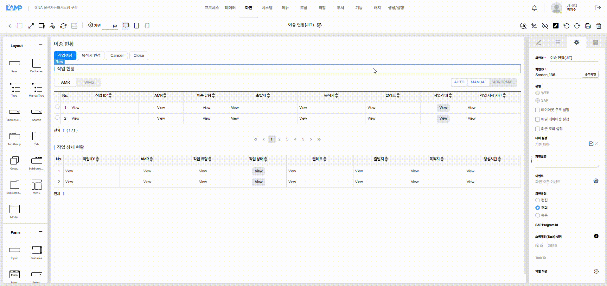
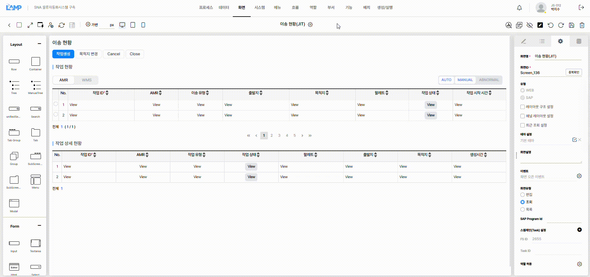
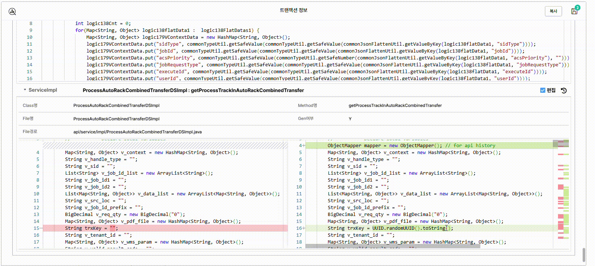
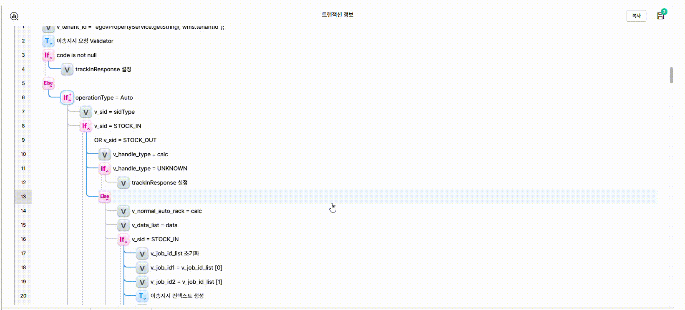

# LAMP7 Genie

LAMP7의 **화면 설계(Visual editor)**와 **로직 설정(Event / Transaction)**에서 검색·다중선택·삭제·복사·붙여넣기를 돕는 Chrome 확장 프로그램입니다.

## 설치

1. 받은 파일의 압축을 풉니다. 소스만 받은 경우 아래 [직접 빌드](#직접-빌드)를 먼저 진행하세요.
2. Chrome에서 `chrome://extensions`를 열고 **개발자 모드**를 켭니다.
3. **압축해제된 확장 프로그램을 로드합니다**를 눌러 `dist` 폴더를 선택합니다.
4. LAMP7의 화면 설계 또는 로직 설정 화면에서 확장 프로그램 아이콘을 클릭합니다.

업데이트 후에는 작업 내용을 저장하고, 확장 프로그램과 LAMP7 페이지를 새로고침하세요.

## 기본 사용법

- **찾기:** 검색어를 입력하고 결과를 누르면 해당 위치로 이동합니다.
- **선택:** **편집 → 선택 시작**을 누른 뒤 클릭으로 선택·해제하거나 드래그로 여러 항목을 고릅니다.
- **복사·삭제:** 보라색 조작 바에서 실행합니다. 선택 목록의 **×**로 개별 선택을 해제할 수 있습니다.
- **붙여넣기:** 원하는 화면에서 **붙여넣기**를 누르고, 마우스로 삽입 위치를 확인한 뒤 클릭합니다. 다른 화면·Chrome 탭에서도 사용할 수 있습니다.
- **종료:** **종료** 또는 `Escape`를 누릅니다. 복사·붙여넣기가 끝나면 기본 패널로 돌아갑니다.

선택모드에서는 편집 영역 바깥에서도 드래그를 시작할 수 있습니다. 붙여넣는 동안에는 진행 상태가 표시됩니다.

## 화면 설계

**ID·라벨·텍스트로 컴포넌트를 검색**합니다. 중복된 라벨·Grid 셀은 묶어서 표시하고, 숨김 항목에는 숨김 상태를 표시합니다.

- 드래그 영역에 **완전히 들어온 항목**을 선택합니다. 부모를 선택하면 숨김 항목을 포함한 하위 전체가 함께 처리됩니다.
- Grid·Tree·Cascader 등 복합 항목은 본체 단위로 선택합니다.
- 붙여넣을 때 컨테이너 안·다른 항목 앞뒤·최상위 등 가능한 위치가 표시됩니다.
- 구조·라벨·스타일·설정·이미지를 복사하며, **관련 이벤트·로직은 복사하지 않습니다.**
- 함께 복사한 항목끼리의 연결은 유지합니다. 복사하지 않은 항목이나 대상에 없는 테이블·열과의 연결은 해제합니다.
- 항목 ID는 유지하며, 중복되면 뒤에 숫자를 붙입니다.

개별 탭 제목은 탭 그룹 전체로 복사하세요. 서브스크린은 전체 대신 내부 Row·컴포넌트를 복사할 수 있습니다.

<details>
<summary>화면 설계 데모 보기</summary>

**검색**



**선택·삭제·복사·붙여넣기**



</details>

## 로직 설정

**로직 Prefix·변수 ID·호출 메소드·조건값 등으로 로직을 검색**합니다.

- 드래그 영역에 **일부라도 겹친 로직**을 선택하며, 원본 전체 로직에서의 순번을 표시합니다.
- 붙여넣을 때 **조건·반복 로직의 하위** 또는 **같은 단계의 다음 위치**를 고를 수 있습니다.
- 변수 로직에서 사용하는 일반 지역변수도 함께 추가합니다. 같은 ID의 정의가 다르면 새 번호를 붙여 연결합니다. 전역변수·입력 파라미터는 자동 추가하지 않습니다.

<details>
<summary>로직 설정 데모 보기</summary>

**검색**



**선택·삭제·복사·붙여넣기**



</details>

## 단축키

| 단축키 | 동작 |
| --- | --- |
| `Alt + Shift + F` | 패널 열기·검색창으로 이동 |
| 검색창에서 `Enter` / `Shift + Enter` | 검색·다음 결과 / 이전 결과 |
| `Escape` | 패널 닫기·선택 종료·위치 선택 취소 |

단축키는 `chrome://extensions/shortcuts`에서 변경할 수 있습니다.

## 사용 시 참고

- **LAMP7 공식 기능이 아닌 개인 제작 도구**입니다. 버전이나 화면 구조에 따라 오류가 발생할 수 있습니다.
- 자동 저장·일괄 실행 취소는 제공하지 않습니다. 편집 결과와 생성된 소스를 확인한 뒤 저장하세요.
- 오류로 중단되면 일부 항목이 이미 생성됐을 수 있습니다. 표시된 결과를 확인한 뒤 다시 진행하세요.

문의·오류 제보·기능 제안은 제작자에게 알려주세요. 소스 수정과 활용도 환영하며, 개선 사항은 PR로 공유해 주세요.

## 직접 빌드

```bash
npm install
npm run build
```

생성된 `dist` 폴더를 Chrome에 등록하면 됩니다. 개발에 참여할 때는 [개발 규칙](AGENTS.md)과 [개발·검증 안내](docs/development.md)를 확인해 주세요.
